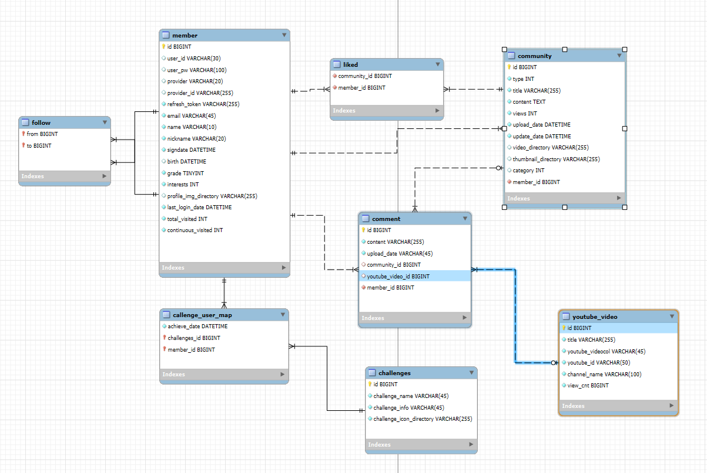

# 🏋️ SSAFIT
### Share Stories, Achieve Fitness, Inspire Together
> **혼자 하는 운동에서 함께하는 여정으로** > 커뮤니티 기반 맞춤형 스마트 피트니스 플랫폼

 

## 📌 프로젝트 소개
**SSAFIT**은 운동 영상 데이터를 기반으로 사용자에게 맞춤형 운동 콘텐츠를 추천하고, **리뷰 · 커뮤니티 · 챌린지**를 통해 지속적인 운동 동기부여를 제공하는 웹 서비스입니다.

- 운동 초보자의 **진입 장벽**을 낮추고
- 혼자 운동하며 **쉽게 포기하는 문제**를 해결하며
- **커뮤니티와 보상**을 통해 꾸준함을 유도하는 것을 목표로 합니다.

 

## 🎯 기획 배경
### 😥 문제 정의
* **진입 장벽**: 운동 방법을 몰라 시작이 어려움
* **지속성 부족**: 혼자 운동하면 쉽게 포기하게 됨
* **정보 과잉**: 정보는 많지만 초보자에게는 과도하고 복잡함
* **피드백 부재**: 동기부여 및 피드백 구조의 부재

### 💡 해결 방향
* **영상 중심 콘텐츠 제공** → 이해도 향상
* **AI 기반 추천** → 개인 맞춤 경험 제공
* **커뮤니티 & 챌린지** → 지속성 확보

 

## 👤 페르소나 요약
**이다함 (25세, SSAFY 교육생)**
* 혼자보다 **함께할 때 동기부여**가 되는 성향
* 운동의 필요성은 느끼지만 **방법과 지속성**이 부족
* 경쟁, 보상, **커뮤니티 요소**에 긍정적 반응

 

## ✨ 핵심 기능
**1. AI 맞춤 추천**
- 사용자 관심사 기반 운동 영상 추천
- 추천 게시글 노출을 통한 콘텐츠 탐색 최소화
- **Gemini Flash AI** 활용

**2. 운동 영상 관리**
- YouTube API 연동
- 카테고리별 운동 영상 제공
- 영상 상세 조회 및 댓글 기능

**3. 커뮤니티**
- 게시글 작성 / 조회
- 댓글 및 추천 기능
- ‘오운완’ 인증 기반 소통

**4. 챌린지 & 대시보드**
- 사용자 활동 기반 정보 시각화
- 도전과제 달성 현황 제공
- 팔로우 / 팔로워 관계 관리

**5. 마이페이지**
- 사용자 정보 및 등급 조회
- 개인 활동 내역 확인

 

## 🗂 페이지 구조
| 페이지 | 설명 |
| --- | --- |
| **Index** | 서비스 소개 |
| **Login / Sign-up** | 인증 및 관심사 설정 |
| **Main** | AI 추천 영상 & 게시글 |
| **Video** | 영상 목록 / 상세 |
| **Community** | 게시글 목록 / 상세 |
| **Dashboard** | 활동 요약 / 챌린지 |
| **My Page** | 사용자 정보 |

 

## 🛠 기술 스택 (Tech Stack)

### Backend

### Frontend

### Database

### Collaboration Tools

 

## 🗃 ERD 개요

* `member` : 사용자 정보, 관심사, 챌린지
* `youtube_video` : YouTube API 기반 영상 데이터
* `community` : 게시글
* `comment` : 커뮤니티 / 영상 댓글 통합 관리
* `challenge` : 도전과제 정보

 

## ⚙️ Troubleshooting

### 1️⃣ 팔로우 여부 조회 성능 개선
* **문제**: `SELECT COUNT(*)` 사용으로 데이터 증가 시 불필요한 Full Scan 발생 가능
* **해결**: `EXISTS` 쿼리로 변경 및 Java 반환 타입을 `Boolean` (Wrapper Class)으로 처리하여 Null Safety 확보
* **결과**: 쿼리 응답 속도 개선 및 불필요한 연산 제거

### 2️⃣ AI API Payload 최적화
* **문제**: 전체 게시글/영상 데이터를 전달할 경우 AI API 프롬프트 제한(Token Limit) 초과 발생
* **해결**: DB 조회 시 데이터 샘플링(`rand()`, `LEFT()`) 및 AI 연산에 필요한 핵심 메타데이터만 JSON으로 가공하여 전달
* **결과**: AI 응답 속도 개선 및 API 호출 안정성 확보

 

## 🚀 향후 개선 계획 (What's Next)
* **AI 추천 고도화**: 사용자 행동 기반 알고리즘 개선
* **챌린지 기능 확장**: 사용자 직접 생성 & 공유 기능 도입
* **실시간 소통**: WebSocket · STOMP 기반 메신저 구현
* **소셜 로그인**: OAuth2 (Google / Kakao) 연동
* **클라우드 배포**: AWS EC2 기반 서비스 상용화
